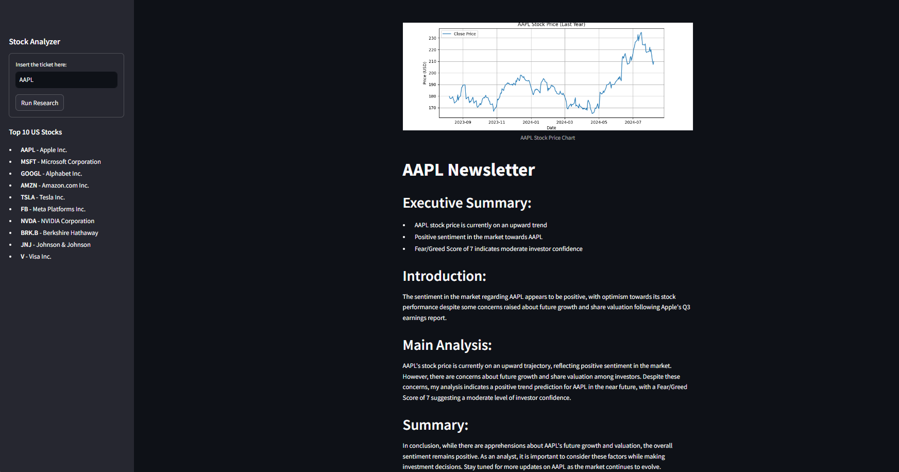

# 📈 Stock Agents - AI Stock Analysis

Welcome to **Stock Agents**, a Python-based project developed during the "IA na Prática" event hosted by [Rocketseat](https://github.com/Rocketseat).
This project leverages AI and custom agents to analyze market trends, historical stock prices, and recent news for stocks listed on U.S. exchanges.



## 🚀 Project Overview

Stock Agents is designed to provide insights into a specific stock's market trends by combining historical data and news analysis. The project uses the following custom agents:

- **Data Collector Agent**: Fetches historical stock price data using the Yahoo Finance API.
- **News Collector Agent**: Gathers recent news related to the stock using the DuckDuckGo API.
- **Trend Analyst Agent**: Analyzes the data and news to predict the stock's future trend (up, down, or sideways).

The result is a comprehensive report, including a summary of the market sentiment and predictions about the stock's near-term performance.

## 🎯 Features

- **Stock Price Analysis**: Fetches and plots the closing prices of a specified stock over the past year.
- **News Analysis**: Searches for the latest news articles about the stock to provide context and additional insight.
- **Trend Prediction**: Combines data and news analysis to predict the stock's trend and provides a fear/greed score based on the news sentiment.
- **User-Friendly Interface**: Built with Streamlit, offering an easy-to-use interface for interacting with the agents.

## 🛠️ Technologies Used

- **[CrewAI](https://github.com/crew-ai/crewai)**: For creating and managing custom agents.
- **[LangChain](https://github.com/hwchase17/langchain)**: To facilitate the integration between tools and the GPT-3.5-turbo model.
- **[OpenAI GPT-3.5-turbo](https://platform.openai.com/docs/models/gpt-3-5)**: The core language model powering the agents' decision-making and analysis.
- **[Yahoo Finance](https://pypi.org/project/yfinance/)**: For retrieving historical stock price data.
- **[DuckDuckGo Search](https://pypi.org/project/duckduckgo-search/)**: For collecting recent news articles about the stock.
- **[Streamlit](https://streamlit.io/)**: For the web-based user interface.

## ⚙️ Installation

To run this project locally, follow these steps:

1. **Clone the repository**:
   ```bash
   git clone https://github.com/muriloguerreiro/stocks-ai-agent.git
   cd stocks-ai-agent
   ```

2. **Create a virtual environment** (optional but recommended):
   ```bash
   python3 -m venv venv
   source venv/bin/activate  # On Windows, use `venv\Scripts\activate`
   ```

3. **Install dependencies**:
   ```bash
   pip install -r requirements.txt
   ```

4. **Set up environment variables**:
   - Create a `.env` file in the project root directory and add your OpenAI API key:
     ```bash
     OPENAI_API_KEY=your-openai-api-key
     ```

5. **Run the project**:
   ```bash
   streamlit run main.py
   ```

## 🌐 Live Demo

Check out the live demo of the project:

🔗 [Deploy Link](https://stocks-ai-agent-3qivlrdcdfhqnjbtdckdnz.streamlit.app/)
